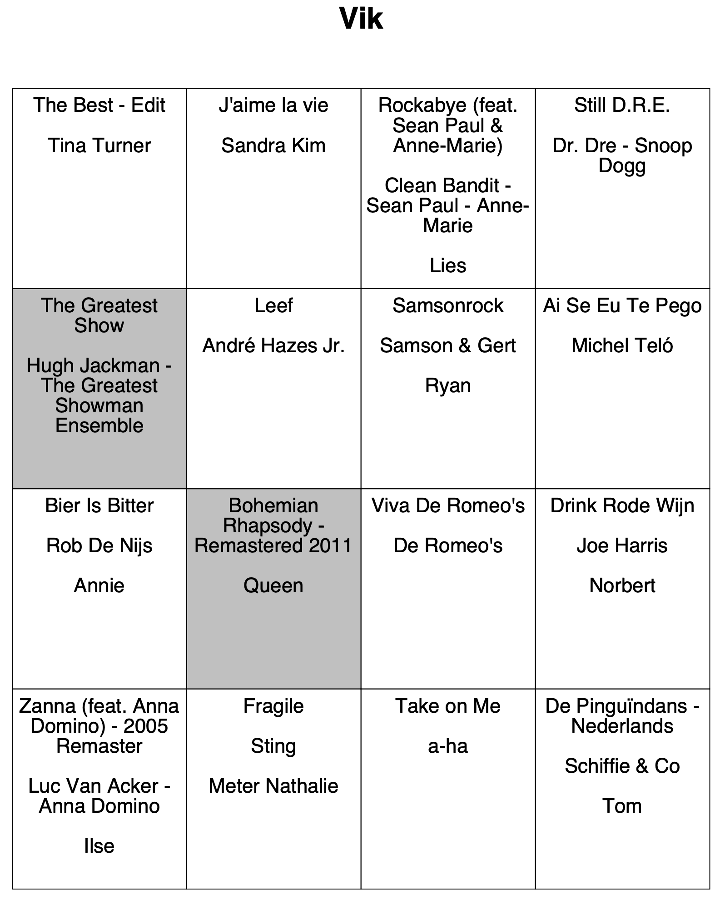

# Spotify Bingo Card Generator

Create cards to play a Music Bingo.

The data source is a comma delimited CSV-file with three columns:

* Song title
* Artist
* Name of the person that chose the song (can be empty)

```csv
The Greatest Show,Hugh Jackman - The Greatest Showman Ensemble,Vik
Rode rozen in de sneeuw,Marva,Omer
Macarena,Los Del Rio,
```

For each person that selected a song, a card will be generated containing all the songs selected by the person 
and random songs until the card is full. The own songs are marked in grey, and the other songs show the name of 
person that chose the song (if available).



## Create the cards

* Export the playlist and add the persons names as described below
* Update the filename in the `Application` class

## Export from Spotify

* Create a playlist in Spotify
* Select the playlist in https://watsonbox.github.io/exportify/ and click "Export"
* Copy the CSV file to /src/main/resources
* Open the file with a spreadsheet editor, and only keep the song and artist column
* Add a column with the name of the person who selected the song, not all songs need a name
* Search and replace all commas
